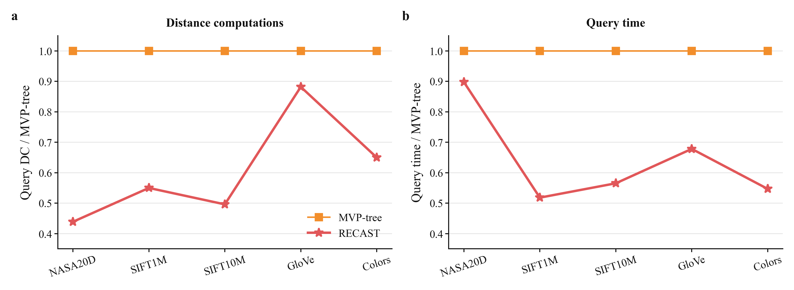
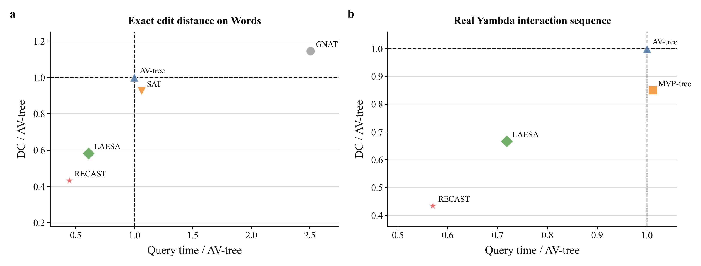
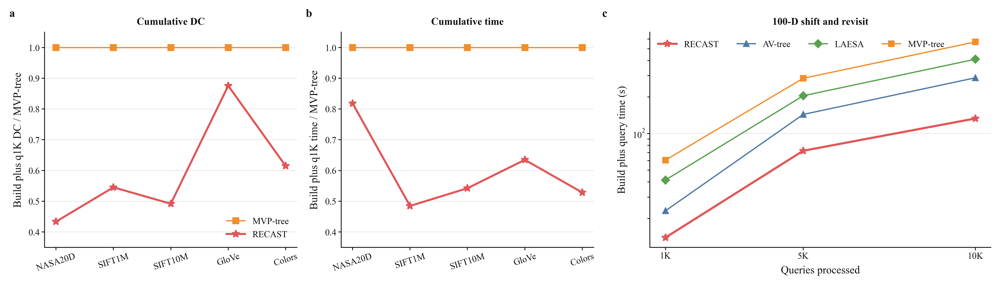
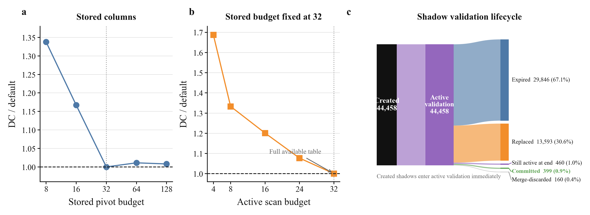

# RECAST Extended Experimental Report

Technical supplement to the rebuttal

## Scope

This report provides additional evidence for the issues shared by the three reviewers: baseline coverage, real query behavior, expensive distance functions, total cost, parameter settings, and the separate roles of the cost signal and shadow validation.

## 1. Additional Experimental Setup

### Datasets and distance functions

| Dataset | Objects | Dimension | Distance function | Purpose in this report |
|---|---:|---:|---|---|
| NASA20D | 40,150 | 20 | L2 | Boundary case with a cheap distance function |
| SIFT1M | 1,000,000 | 128 | L2 | High-dimensional data |
| SIFT10M | 10,000,000 | 128 | L2 | Larger dataset |
| GloVe | 1,200,000 | 100 | L2 | Embedding data |
| Colors | 112,682 | 112 | QFD | Quadratic-form distance |
| Words | 103,250 | variable | Edit distance | Expensive distance function |
| Yambda | 447,694 | 128 | L2 on normalized audio embeddings | Real user interaction sequence |

For Colors, `dA(x,y) = sqrt((x-y)^T A (x-y))`, where `A = R^T R`. The fixed matrix is positive definite, with a minimum eigenvalue of `3.8732e-5`. The QFD used in this experiment therefore satisfies the metric properties.

## 2. Main Comparison

**Figure 1. Main comparison between RECAST and MVP-tree**

Across NASA, SIFT1M, SIFT10M, GloVe, and Colors, RECAST uses 0.439 to 0.882 times the query DC of MVP-tree and 0.518 to 0.898 times its query time. The peak resident set size of RECAST is 2.46 to 4.63 times that of MVP-tree. We measure this value using the maximum resident set size reported by `/usr/bin/time -v`. It includes the index, distance tables, and working memory used during queries. It is not the index file size.

### Joint view of DC and query time

**Figure 2. Joint cost in distance computations and query time**

DC counts only evaluations of the distance function `d`. It excludes triangle inequality bound tests, pivot column scans, tree routing, memory accesses, and index updates. DC therefore measures how many distance evaluations an index avoids. It is also less sensitive to hardware and implementation details than time. For edit distance, graph distance, or distances between complex objects, one evaluation can cost much more than ordinary arithmetic and table access. In these settings, DC directly measures the main benefit of pruning. The metric indexing survey by Chávez et al. and the M-tree and MVP-tree papers use the same cost separation. We use DC because of this cost structure, not only because earlier work reports it.

Query time evaluates the complete implementation. Timing begins after the data and queries have been loaded. It includes distance evaluations, bound tests, pivot column scans, tree traversal, memory accesses, and online index updates, but excludes input and output. We record the one-time construction cost of each pre-built index separately and include it in cumulative cost. Every index has costs beyond distance evaluation. Tree indexes pay for node traversal and routing. Pivot-table methods pay for scanning distance columns. RECAST also pays for maintaining region-scoped pivot tables and updating the index online. We therefore use DC to explain pruning and query time to determine whether the saved distance computations offset index management costs.

In Figure 2, each point represents one method. The horizontal axis is relative query time, and the vertical axis is relative DC. A method in the lower left uses less of both.

Figure 2a reports 2,000 exact edit distance queries over 103,250 strings in Words. RECAST uses 15,213.8 DC and 5.628 ms per query. AV-tree uses 35,156.3 DC and 12.695 ms, while LAESA uses 20,473.5 DC and 7.722 ms. RECAST is in the lower left of all exact baselines. Relative to AV-tree, it reduces DC by 56.7 percent and query time by 55.7 percent. A replay pinned to one CPU core also shows that one edit distance evaluation costs 4.90 to 8.52 times one NASA20D L2 evaluation, depending on string length. The reduction in DC therefore translates into a similar reduction in time.

Figure 2b uses the real user interaction sequence from Yambda. Relative to AV-tree, LAESA, and MVP-tree, the DC/time ratios of RECAST are 0.434/0.570, 0.651/0.793, and 0.510/0.563, respectively. RECAST is again in the lower left of all compared indexes. We do not use DC as a substitute for total time. DC explains pruning, query time measures implementation performance, and peak resident set size and cumulative cost account for memory and construction.

## 3. Cumulative Cost versus Pre-Built Indexes

**Figure 3. Cumulative performance including construction cost**

MVP-tree construction ranges from 160,406 DC and 0.367 seconds on NASA to 79.88 million DC and 281.9 seconds on SIFT10M. After charging this cost once, RECAST uses 0.434 to 0.876 times the cumulative DC of MVP-tree and 0.485 to 0.818 times its cumulative time at q1K.

Figures 3a and 3b report the q1K cumulative cost ratios on the five submitted datasets. The long query stream follows three stages. At the start, MVP-tree and LAESA have already paid their complete construction cost, while RECAST and AV-tree begin with empty structures. As queries continue, RECAST accumulates region-scoped pivot columns, AV-tree refines one global tree, and the two pre-built indexes remain unchanged. We then examine the additional cost from q5K to q10K to determine whether the result changes after the construction cost has been amortized.

Figure 3c reports a q10K case study on a 100-dimensional workload that visits region A, moves to region B, and then returns to region A. When the workload returns, RECAST can reuse the pivot columns accumulated earlier in region A. At q10K, its cumulative time is 0.462 times that of AV-tree, 0.325 times that of LAESA, and 0.234 times that of MVP-tree. From q5K to q10K, RECAST, AV-tree, LAESA, and MVP-tree add 61.0, 144.3, 204.6, and 283.3 seconds, respectively. RECAST still has the lowest slope after the construction cost has been amortized. Its result therefore comes from region-scoped reuse in later queries, rather than only from avoiding an upfront construction phase.

The GlobalPT-all ablation in the submitted paper explains why long-term reuse must still bound pivot-table scans. GlobalPT-all uses only 0.775 times the DC of RECAST, but takes 2.56 times its query time because every query scans a global table that continues to grow. RECAST bounds the number of stored and active pivot columns within each region. This allows later queries to reuse paid distances without making the scan cost of each query grow with the complete query history.

## 4. Parameter Sensitivity

| Function | Default | Five tested values | Setting rationale |
|---|---:|---|---|
| Pivot budget | 32 | 8, 16, 32, 64, 128 | Main memory and reuse budget |
| Active budget | 32 | 4, 8, 16, 24, 32 | Pivot columns scanned by each query |
| Leaf-size threshold | 128 | 32, 64, 128, 256, 512 | Avoid routing structures for small leaves |
| Minimum region size | 512 | 128, 256, 512, 1024, 2048 | Require enough objects to offset partition cost |
| Minimum checked objects / false positives | 64 / 32 | 16 to 256 / 8 to 128 | Require enough evidence before creating a pivot column |
| EMA coefficient | 0.25 | 0.0625, 0.125, 0.25, 0.5, 1 | Smooth an isolated query while following workload changes |
| Shadow visits / net threshold | 4 / 16 | 1 to 16 / 4 to 64 | Require repeated positive net savings before commitment |
| Candidate / eviction cost spike | 2 / 4 | 0.5 to 8 / 1 to 16 | Separate ordinary changes from a large cost increase |
| Checked-object ratio | 0.20 | 0.05, 0.10, 0.20, 0.40, 0.80 | Minimum checked fraction for a partition candidate |

**Figure 4. Parameter sensitivity and the lifecycle of shadow validation**

The sensitivity study varies one parameter at a time. It covers 12 parameter families, 49 configurations, two workloads, and two seeds, for 196 formal q1K runs. The same default values are used for every dataset and workload.

The pivot budget shows a clear change near 32. Reducing it to 16 and 8 increases DC by 16.7 and 33.8 percent. Increasing it to 64 or 128 changes DC by at most 1.1 percent.

The active budget experiment fixes the pivot budget at 32. The tested values from 4 to 32 therefore cover the complete effective range, because a value above 32 cannot activate a pivot column that is not stored. DC decreases as more stored columns are used. The default value of 32 allows a query to use the complete stored table. It is not an unconstrained optimum selected at an arbitrary end of the search range. Reducing the active budget to 24, 16, 8, and 4 increases DC by 7.7, 20.1, 33.3, and 68.7 percent, respectively.

The pivot budget and active budget directly control how many paid distances a query can retain and use, so they have the largest effect. A small pivot budget removes useful columns too early. Above 32, additional columns largely duplicate existing pruning evidence and give little further reduction. The active budget controls how many stored columns the current query uses. Setting it equal to the pivot budget allows each query to use the complete table.

The other parameters affect only pivot admission, partition candidate selection, shadow validation, or replacement after a cost spike. Shadow validation further limits their effect, so their results remain stable over wide ranges.

| Parameter | Five tested values | Complete DC range | Role |
|---|---|---:|---|
| Leaf-size threshold | 32 to 512 | 2.32% | Changes only leaves close to the partition boundary |
| Minimum region size | 128 to 2048 | 0.19% | Prevents partitioning a region that is too small to offset the cost |
| Shadow visits | 1 to 16 | 1.85% | Controls how many later queries test a shadow before commitment |
| Net threshold | 4 to 64 | 0.12% | Requires accumulated saved checks to cover the added routing cost |
| Minimum checked objects | 16 to 256 | 2.08% | Prevents a decision based on too few checked objects |
| Minimum false positives | 8 to 128 | 0.30% | Requires enough candidates that a new pivot column could prune |
| Checked-object ratio | 0.05 to 0.80 | <0.01% | Requires the checked objects to represent enough of the current region |
| EMA coefficient | 0.0625 to 1 | 2.40% | Controls how quickly the cost signal follows workload changes |
| Candidate cost spike | 0.5 to 8 | 2.70% | Controls which cost increase can create a candidate partition |
| Eviction cost spike | 1 to 16 | 2.90% | Controls when a cost increase permits replacement of retained pivots |

The minimum checked-object, false-positive, and checked-object ratio thresholds reject decisions with insufficient evidence. They do not continuously change the work of every query, so their precise values have little effect within the tested ranges. The EMA coefficient and the two cost spike thresholds directly control the response to workload changes and the timing of pivot replacement, so their effects are larger. In practice, the shared defaults are the starting point. The pivot budget and active budget are the first parameters to adjust when changing memory use or pivot-table scan cost.

## 5. Component Ablation

### Separate roles of the cost signal and shadow validation

| Intervention | Controlled setting | DC change | Query time change | Interpretation |
|---|---|---:|---:|---|
| Remove shadow validation | Cost signal used | +7.61% | +64.36% | Validation prevents costly immediate partitions |
| Remove shadow validation | Cost signal not used | +7.02% | +63.44% | The effect of validation does not depend on the cost signal |

With the cost signal held fixed, shadow validation reduces mean DC by 6.24 percent and mean query time by 29.47 percent relative to immediate partitioning. It reduces DC in 17 of the 20 settings. Both controlled comparisons give the same conclusion: the main protection comes from testing a candidate partition before changing the actual structure, whether or not the cost signal is used.

The cost signal determines which candidate partitions satisfying the basic size conditions enter shadow validation or are committed immediately. In seed 1, removing the cost signal decreases DC by only 0.05 percent with shadow validation and 0.51 percent without it. In seed 2, which uses the reverse execution order, DC decreases by 0.06 percent with shadow validation and increases by 0.47 percent without it. The independent effect of the cost signal on DC is therefore within about 0.5 percent. The time difference changes direction with execution order, so we do not attribute it to the cost signal or report it as a component gain.

### Shadow lifecycle

Figure 4c uses the completed E145 seed 1 diagnostic replay over five datasets and four query workloads. It records the outcomes of all 44,458 shadows. After a shadow is created, later queries test whether its candidate partition would reduce distance computations. The partition is then committed, or the shadow expires without commitment, is replaced by a new shadow, is discarded after a merge, or remains active when the query stream ends. Only 399 shadows, or 0.9 percent, lead to a committed partition.

| Shadow outcome | Count |
|---|---:|
| Created | 44,458 |
| Partition committed | 399 |
| Expired without commitment | 29,846 |
| Replaced by a new shadow | 13,593 |
| Discarded after a merge | 160 |
| Active at the end of the query stream | 460 |

Among the 43,998 shadows that reached a final outcome, 399 led to a committed partition and 43,599 expired, were replaced, or were discarded. Thus, 99.1 percent did not lead to a committed partition. Candidate selection alone therefore cannot determine whether a partition will save enough work. Shadow validation filters these candidates before they change the actual index.

The two modes without shadow validation perform 1,294,145 and 1,315,123 immediate partitions. The pivot budget of 32 limits the columns stored in one region, and the minimum region size of 512 prevents a small region from being partitioned further. Neither parameter limits the total number of regions, tree depth, or cumulative routing work. Immediate partitioning is slow because many partitions that satisfy the local conditions but save little work accumulate in the tree.

### Effects of datasets and workloads

The effect of each component depends on both the data and the changes in the query regions.

| Comparison | Data or workload property | Component | Observation |
|---|---|---|---|
| Colors/QFD and GloVe/L2 | Pivot columns differ more in pruning power on Colors; high dimensional embedding distances are more concentrated on GloVe, so the triangle inequality bounds of different pivots are similarly weak | Pivot retention | FIFO/LRU uses about 1.26 times the DC on Colors, but adds only about 1 percent on GloVe |
| SIFT1M and SIFT10M | Both use 128D L2; SIFT10M has ten times as many objects | Shadow validation | The mean DC reduction from shadow validation increases from 2.1 to 11.2 percent because one partition that saves little work affects more later scans |
| NASA fixed and three-jump | Fixed queries remain in one region; three-jump visits the separate regions A, B, and C | Shadow validation and the residual child | The time reduction from shadow validation increases from 4.8 to 44.9 percent; without the residual child, three-jump cumulative DC reaches 1.49 times RECAST-full |
| Colors jump and drift | Jump moves directly to B; drift gradually increases the fraction of queries from B | Shadow validation | In this seed, immediate partitioning uses 0.91 and 0.84 times the DC of RECAST-full, so waiting for validation is not beneficial for every transition |

Pivot retention decides which pivot columns remain in a region. When their pruning power differs substantially, retaining columns by cumulative gain is more useful than FIFO or LRU. When distance concentration makes all pivot bounds weak and similar, replacement order matters less. Shadow validation decides whether to partition a region at the current point in the query stream. Its role grows with the number of objects affected by one partition and with the number of later queries that use the resulting structure. The residual child stores objects whose distance to the split center was not computed. When later queries visit a new region, these objects remain in a separate region that can continue to learn, rather than being repeatedly scanned in the old parent region. The cost signal selects which candidate partitions enter validation. The E145 ablation shows that it is not the main source of DC reduction by itself.

The NASA three-jump workload sends approximately 333 queries to each of three separate regions, in the order A, B, and C. The phase results are as follows.

| Query phase | No shadow / full DC | No shadow / full time | No residual / full DC |
|---|---:|---:|---:|
| A | 1.10 | 1.58 | 1.11 |
| B | 1.20 | 1.76 | 1.53 |
| C | 1.16 | 1.69 | 1.91 |

During phase A, all variants learn from an empty structure. Removing shadow validation or the residual child therefore increases DC by only about 10 percent. Phase B introduces the first change of query region. The pivot columns accumulated in A provide weak pruning for the new candidates. Immediate partitioning changes the actual structure using only the first few queries after this change. Its phase DC and time rise to 1.20 and 1.76 times those of RECAST-full. Shadow validation first uses later queries to test whether the candidate partition saves enough checks to offset its added routing cost.

The cost of removing the residual child accumulates across phases. Without a residual child, objects that were not classified by an earlier partition remain in the old parent region. They are scanned repeatedly in phase B, where the phase DC reaches 1.53 times that of RECAST-full. In phase C, objects left by both earlier phases remain mixed in parent regions, and the phase DC reaches 1.91 times that of RECAST-full. The cumulative DC ratio without the residual child is 1.11 after A, 1.33 after B, and 1.49 after C. This case separates the two roles. Shadow validation prevents a candidate partition based on a short change from altering the index unless later queries confirm its value. The residual child prevents objects with an unknown distance to the split center from being scanned repeatedly in the old parent region.

## 6. Additional Results

### Exact kNN

| Dataset | Fixed RECAST/AV DC | Jump RECAST/AV DC |
|---|---:|---:|
| NASA20D | 0.737 | 0.671 |
| SIFT1M | 0.920 | 0.971 |
| GloVe | 1.001 | 0.970 |

For `k = 10`, fixed and jump workloads, and two seeds, all 12,000 queries return the exact k nearest neighbors. The lightweight extension retains one complete pivot column whose object distances were computed by an earlier query in each current leaf. It combines this column with the search radius set by the current kth candidate for safe triangle inequality pruning. These results support exactness and workload-dependent DC reduction. They do not establish a general query time advantage for kNN.

### D-Cache-style mechanism study

No official D-Cache implementation is publicly available. A separate experiment in a common executor implements its published obsolete-distance replacement policy. We label this comparison D-Cache-style rather than the original implementation.

| Dataset | RECAST DC reduction | RECAST query time reduction |
|---|---:|---:|
| NASA20D | 9.58% | 70.43% |
| SIFT1M | 12.95% | 59.81% |
| GloVe | 3.60% | 69.60% |

## References for Distance Computation Cost

- Chávez, Navarro, Baeza-Yates, and Marroquín. *Searching in Metric Spaces*. ACM Computing Surveys, 2001.
- Ciaccia, Patella, and Zezula. *M-tree: An Efficient Access Method for Similarity Search in Metric Spaces*. VLDB, 1997.
- Bozkaya and Özsoyoglu. *Indexing Large Metric Spaces for Similarity Search Queries*. ACM TODS, 1999.
